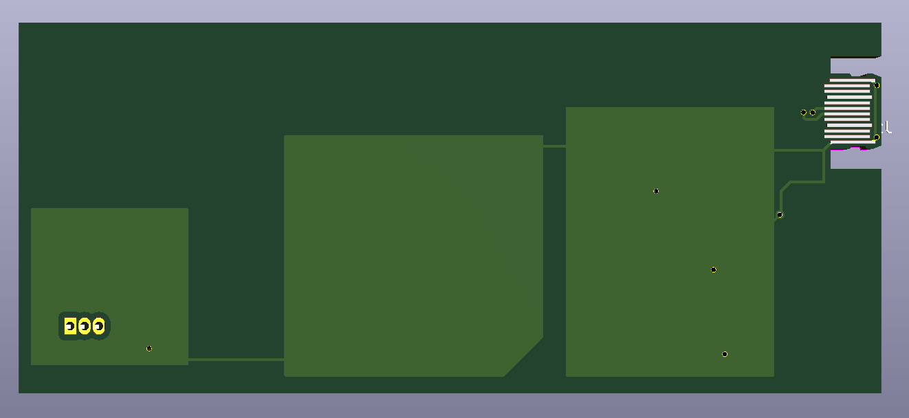

# random_bytes' Business card

Here is a business card which functionality is related to my username.

The feature of the card is to generate random outputs where the source of randomness is a hardware random number generator, just by pressing the capacitive touch area on the card.

The hardware random number generator is based on [the following article](https://makezine.com/projects/really-really-random-number-generator/) with its implementation in the RAND frame on the card.

For this to work, I needed a 18V power source, so I implemented a 5V to 18V step up in the POWER frame.

The DIP switches let the user chose between different output formats, which could be 8bit integer, floating point value, alphanumeric keystrokes, mouse pointer displacement, ...

The USB-C port is a concept experiment where the connector plate of a USB-C receptacle is built in the PCB. If the PCB is printed with 0.6mm width, this could work.

I have no idea if it works!

