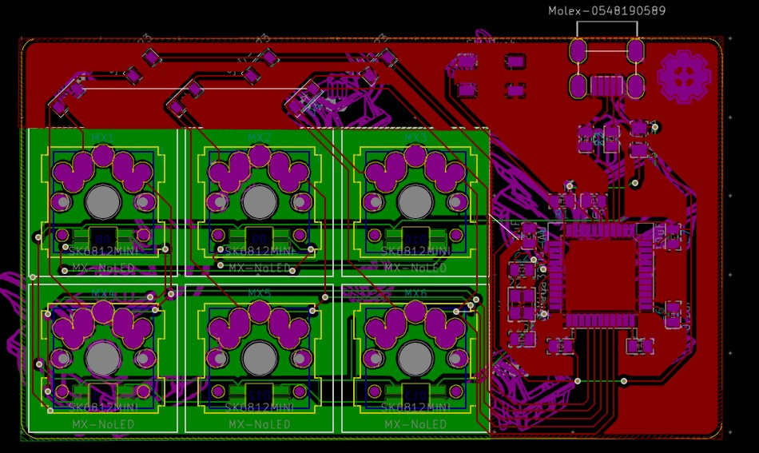
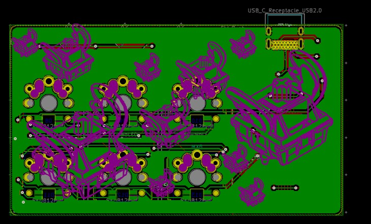
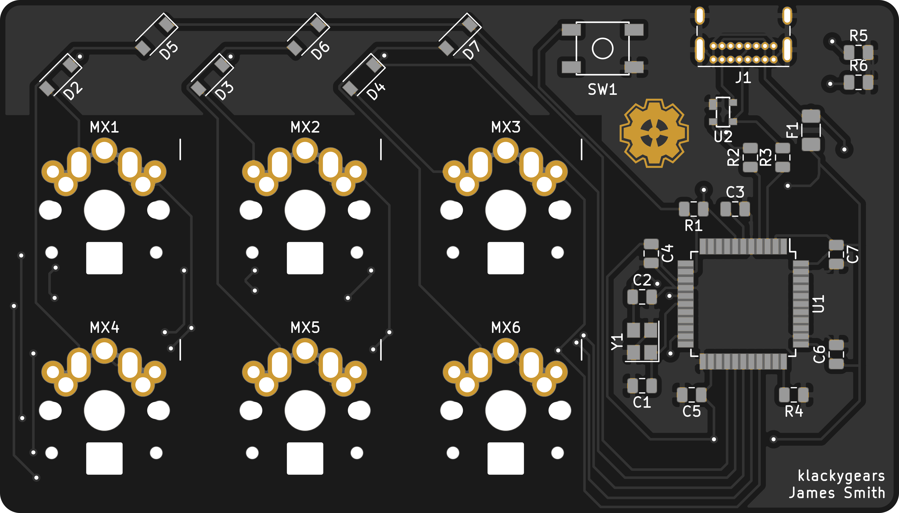
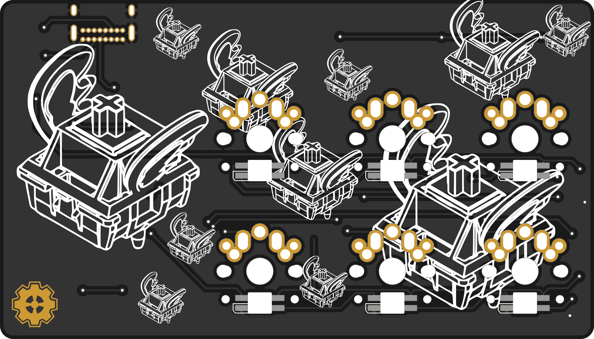

# klackygears's Business card

This is my first pcb design. (I followed ai03's guide. Huge thank you!) I thought it would be fun to try some things while I was learning. It has footprints for SK6812 MINI-E that I hope work. (Big thanks to Maarten for making 95% of that footprint!) It also has a fun silk screen design I made that is inspired by the old Flying Toaster screensaver.

It's a 6 key macro pad with per-key RGB.
