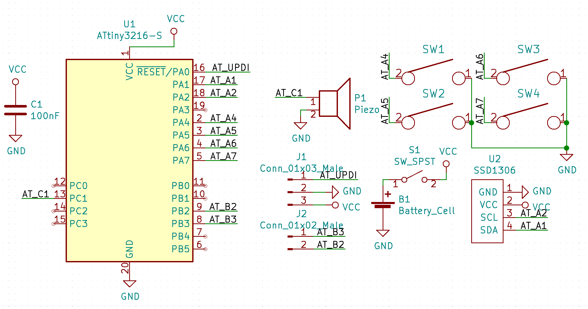

# KeyPCB's Business card


### [View more photos here](photos.md)

My business card features a unique design and a variety of games that you can play on it. I've split the information into two sections:

 - Hardware - information about the hardware, schematics, and setting up PCBmodE to edit the PCB and export Gerbers
 - Firmware - information about the firmware features, how to set up Arduino IDE to edit it, and how to program the card.

## Hardware
My card has a PCB that is designed in PCBmodE, a PCB editor that lets you define the PCB in JSON files and route it using Inkscape (a vector graphics editor). This makes it very flexible and allows you to have features such as traces that are curves, custom copper fill patterns, and native support for different fonts and vector graphics. The card's design takes full advantage of this flexibility, and has a unique aesthetic that something like KiCad couldn't reproduce. 

Onboard, there are four Kailh Choc switches, one in each corner, a 128x64 OLED display, a CR2032 battery holder hidden underneath the display, a piezo speaker, and an ATtiny3216 microcontroller. This microcontroller has capabilities similar to (and in some cases better than) the ATmega328, the microcontroller in the Arduino Uno, and it allows the card to run several games and provide information that doesn't need to be printed on the PCB. In order to make sure that the display doesn't short out on the battery holder, a custom 3D printed spacer (`spacer.stl`) is used. There's also a 3D printed key (`key.stl`) that can be used to remove the battery by inserting it in a hole on the back of the spacer. 

### Setting up PCBmodE
I've included pre-made gerbers in this repository, but if you want to be able to export the gerbers yourself, you need to make a small change to PCBmodE's code. First, download PCBmodE (the commands here are for Linux):

```
sudo apt-get install libxml2-dev libxslt1-dev python-dev # or equivalent for your distro
git clone https://github.com/boldport/pcbmode.git
virtualenv pcbmode-env
source pcbmode-env/bin/activate # if using fish shell, change activate to activate.fish
cd pcbmode
```

Now, in the folder `pcbmode/utils`, open the file `utils.py`. In `openBoardSVG`, replace the code in the `try` block with this:

```
        # Use huge tree to parse large SVG files
        p = et.XMLParser(huge_tree=True)
        data = et.parse(filename, parser=p)
```

Then, you can proceed with the installation (make sure that you're back in the initial `pcbmode` directory):

```
python setup.py install
```

Now, create the directory `boards` in `pcbmode/pcbmode`, and copy the directory `card` in this repository (it's in `pcbmode_board`) to this new directory. You'll also need to unzip the `paths_db.json.zip` in `card/build`. `To export the gerbers, go to the `pcbmode` directory, and run:

```
pcbmode -b card --fab oshpark
```

This process will take a while and will probably use about 1.5-2 GB of RAM (this should be improved in PCBmodE version 5). You'll find the gerbers in the directory `pcbmode/pcbmode/boards/card/build/production`. If you want to cut down the file size, install Gerbv and use it to delete the excess copper pour that goes outside the board. 

### Schematic
Here's a schematic:


### Ordering
I ordered the PCBs from JLCPCB in blue with the ENIG surface finish and a 1.0 mm thick board. I also paid extra to have the order number removed. If you don't want to, there's a PCBmodE component called `JLC-number` that you can add to the board. To do this, open the `card.json` file, and add this in the `shapes` section:

```json
    "JLC-number": {
      "assembly": {
        "refdef": {
          "show": false
        }
      }, 
      "footprint": "jlc", 
      "layer": "top", 
      "location": [
        0, 
        6
      ], 
      "rotate": 0, 
      "show": true, 
      "silkscreen": {
        "refdef": {
          "show": false
        }
      }
    },
```

Then (assuming you've already done the PCBmodE setup discussed earlier), run `pcbmode -b card -m` in the `pcbmode` directory. This will take a while. Once that's finished, run `pcbmode -b card --fab oshpark` to generate the gerbers.

### 3D printing
To 3D print the two parts, I used my Prusa i3 MK3S with blue Prusament PLA. This will probably work with other materials too. For the spacer, I rotated the part upside-down, enabled supports, and selected 0.1mm layer height. The settings for the key aren't as important.

## Firmware
The firmware for my card is custom made in the Arduino IDE. It features several applications:

 - KeyPCB - information about me and my PCB design services, taken from [my website](https://keypcb.xyz).
 - Reaction - a multiplayer game where you have to press a button when a timer reaches 0, the player with the most accurate timing wins.
 - Tetris - a Tetris game. This has been ported from [TinyTetris](https://github.com/AJRussell/Tiny-Tetris), and it's been modified to work better with my card (changing button mappings, removing unneeded features to save on flash space, etc).
 - Simon - the classic memory game.
 - Scores - view your high scores from each game.
 - Settings - view the amount of free RAM and reset the high scores.

All of these together take up almost the entire flash memory of the microcontroller, so there probably isn't room to add anything else unless it is really simple.

### Button mappings
In the menu and in KeyPCB, the left two buttons are up and down. In almost everything that isn't a game, the upper right button is select and the lower right is back. For Reaction and Simon, the buttons correspond to the rectangles/numbers shown on screen. Tetris uses a rotated screen, so if you rotate the card so that the power switch is at the bottom, the bottom two buttons are left and right, the upper left button is rotate, and the upper right button is down.

### Setting up Arduino IDE
The ATtiny3216 isn't normally supported in the Arduino IDE, so you'll need to install [megaTinyCore](https://github.com/SpenceKonde/megaTinyCore/blob/master/Installation.md). Once it's installed, make sure the following selections are made in the `Tools` menu:

 - Board: ATtiny3216/1616/... (don't choose the one that says "Optiboot")
 - Chip: ATtiny3216
 - BOD Voltage: 1.8V
 - BOD Mode (active): Disabled
 - BOD Mode (sleep): Disabled
 - Save EEPROM: Set this to "EEPROM retained" unless you want to reset the high scores or re-use a chip with something else in the EEPROM
 - Clock Speed: 20 MHz (you can lower this to try to save battery life but it might affect performance
 - millis()/micros(): Enabled (default timer)
 - Voltage for UART baud calc: Closer to 3v
 - Programmer: jtag2updi (megaTinyCore)

### Programming chip
To program the chip, you will need a programmer. This can be built using almost any Arduino (I used an Uno). Follow the instructions [here](https://github.com/SpenceKonde/jtag2updi) to program the Arduino Uno and to build the programming circuit. The VCC, GND, and UPDI pins are labeled on the board. It's probably a good idea to turn the battery power off and connect the VCC pin to any 3.3V power source (most Arduinos have one) when programming. Once this is set up, you can select the port in the Arduino IDE and click the upload button. 

If you don't have an Arduino but you do have a USB to serial adapter, you can try using [pyupdi](https://github.com/mraardvark/pyupdi). I've sometimes been able to get it to work but a lot of the time it throws a bunch of errors. If you use this you'll have to compile the firmware as a hex file in the Arduino IDE and use the pyupdi command line tool to flash it. 
