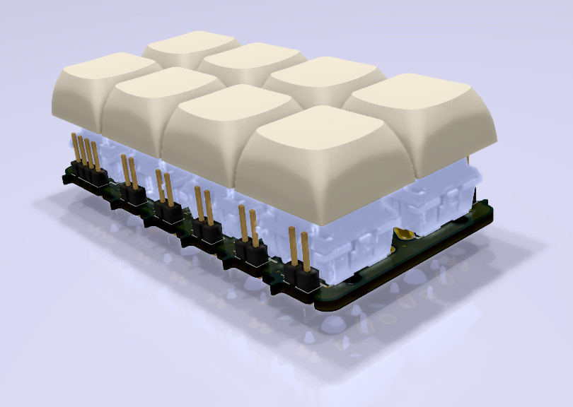
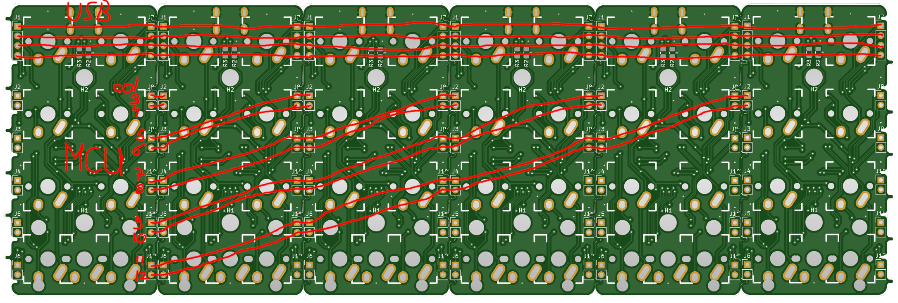
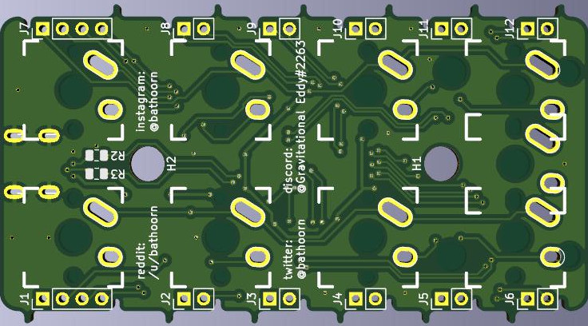
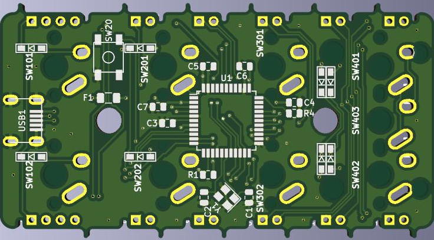

# Ronnie's OrthoCard Business card

# Summary

OrthoCard is a mini Planck like busines card 2x4 keyboard. The keyboard uses an Atmega32u4 as an MCU.
Up to 6 of these OrthoCards can be linked together to form up to a 12x4 Keyboard. The bottom two keys
per card can be switched to one 2u key. When multiple cards are used only the left most card needs to
have the MCU, USB, capacitors, resistors and the fuse soldered on. All cards need the switches and 
diodes to function.

The image below shows how the connections line up. All pads on the side of touching pcb's have to be
connected using solder and diode legs. The top 4 pads connect the rows accross the boards. The
groups of two pads further down along the side of the board connect the columns of each board onto
the next board. Only The most left board can have the MCU and USB connecter because of how the
columns are wired. It would be possible to make a reversible version of the board using a pro micro
where you could flip the boards and have the USB and MCU on the right, but i leave that as an
exercise for the reader. 

When creating a keyboard out of multiple cards it is best to have a plate of the full size of the
board. This will add to the overall stability of the whole assembly.

# PCB

# Parts list

Only the left most board
- 1 x Atmega32U4-AU (U1)
- 1 x 10K Resistor SMD 0805 (R1, R4)
- 2 x 22 Resistors SMD 0805 (R2, R3)
- 2 x 22pF Capacitors SMD 0805 (C1, C2)
- 1 x 1uF Capacitor SMD 0805 (C3)
- 3 x 0.1uF Capacitor SMD 0805 (C4,C5, C6)
- 1 x 10uF Capacitor SMD 0805 (C7)
- 1 x 16Mhz Crystal SMD 3225 (Y1)
- 1 x 500mA Polyfuse SMD 1206 (F1)
- 1 x USB Connector Molex-0548190589 (USB1)
- 1 x Switch SKQG-1155865 (SW20)

And per board
- 7 or 8 MX switches (SW101 - SW403)
- 8 Diodes SMD (D101 - D402)

# Inspiration

I took inspiration for making this board from the following sources:

- Nori 4x4 keyboard from 40percent.club for the making a keyboard out of multiple pcb's shenanigans (http://www.40percent.club/2018/10/nori.html)
- ai03 for the schematics of wiring up an atmega32u4 (https://wiki.ai03.me/books/pcb-design/chapter/pcb-designer-guide)
- All the people that share their KiCad footprint libraries online (keebs, foostan, ai03 and many more!)