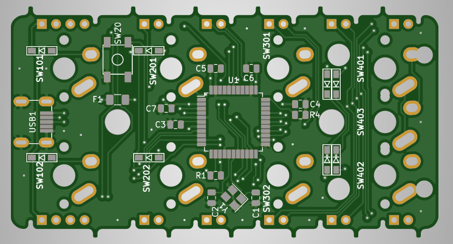

# Ronnie's Business card

Front

Back

#Summary

OrthoCard is a mini Planck like busines card 2x4 keyboard. The keyboard uses an Atmega32u4 as an MCU.
Up to 6 of these OrthoCards can be linked together to form up to a 12x4 Keyboard. The bottom two keys
per card can be switched to one 2u key. When multiple cards are used only the left most card needs to
have the MCU, USB, capacitors, resistors and the fuse soldered on. All cards need the switches and 
diodes to function.

When creating a keyboard out of multiple cards it is best to have a plate of the full size of the
board. This will add to the overall stability of the whole assembly.

#Parts list

Only the left most board
- 1 x Atmega32U4-AU (U1)
- 1 x 10K Resistor SMD 0805 (R1, R4)
- 2 x 22 Resistors SMD 0805 (R2, R3)
- 2 x 22pF Capacitors SMD 0805 (C1, C2)
- 1 x 1uF Capacitor SMD 0805 (C3)
- 3 x 0.1uF Capacitor SMD 0805 (C4,C5, C6)
- 1 x 10uF Capacitor SMD 0805 (C7)
- 1 x 16Mhz Crystal SMD 3225 (Y1)
- 1 x 500mA Polyfuse SMD 1206 (F1)
- 1 x USB Connector Molex-0548190589 (USB1)
- 1 x Switch SKQG-1155865 (SW20)

And per board
- 7 or 8 MX switches (SW101 - SW403)
- 8 Diodes SMD (D101 - D402)
